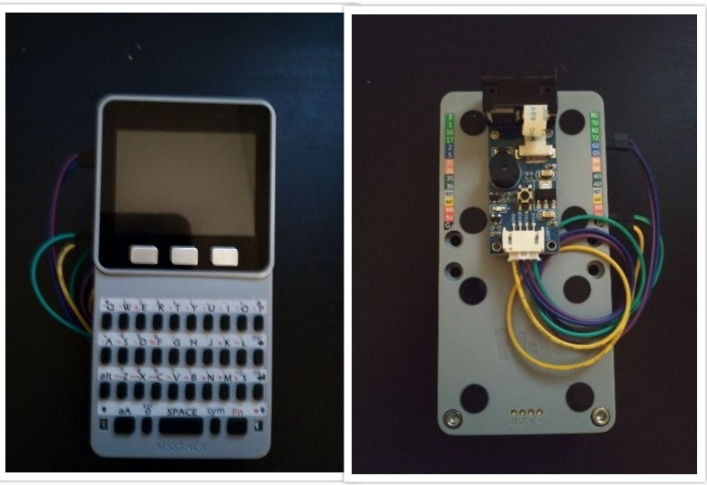

# BitBoy

_A stateless, QR-airgapped hobbyist hardware wallet_

# Workflow:

- Enter BIP39 seed on QWERTY keyboard
- (Optional) Export XPUB to desktop wallet with QR on device display
- Import unsigned PSBT with QR scanner
- After confirming outputs & fees, BitBoy will sign it
- Export signed PSBT with QR on device display

# Shopping List

### BitBoy

QR code airgap, keyboard. $110.

- [M5stack "faces" kit](https://www.amazon.com/MakerFocus-Computer-Keyboard-Calculator-MicroPYTHON/dp/B078NHQWHP) ($70)
- [Waveshare industrial QR scanner](https://www.waveshare.com/barcode-scanner-module.htm) ($40)

### BitBoy "lite"

MicroSD airgap. $42.

- [M5Stack](https://www.amazon.com/M5Stack-Development-Extensible-Control-Prototype/dp/B07PWJMNRN) ($37)
- MicroSD card ($5)

# How it works:

- [Base MicroPython firmware](https://github.com/stepansnigirev/esp32_upy_bitcoin)
    - Bitcoin primitives
    - Drivers for display, buttons, keyboard
- `bitboy.py` in this repo contains the hardware wallet logic itself. It's a modern [asyncio](https://hackernoon.com/a-simple-introduction-to-pythons-asyncio-595d9c9ecf8c) event loop!
- `wallet.py` is a primitive watch-only wallet leveraging Bitcoin Core
- `ui.py` is a shitty UI connecting BitBoy and wallet.py / Bitcoin Core
- Eventually I want this all to work in [Junction](https://github.com/justinmoon/junction)

# Status

This is alpha software, testnet-only for now.

If you'd like to build one, buy the items in the shopping list. Instructions will be posted in the next week. You can [DM Justin with questions on Twitter](https://twitter.com/_justinmoon_).
